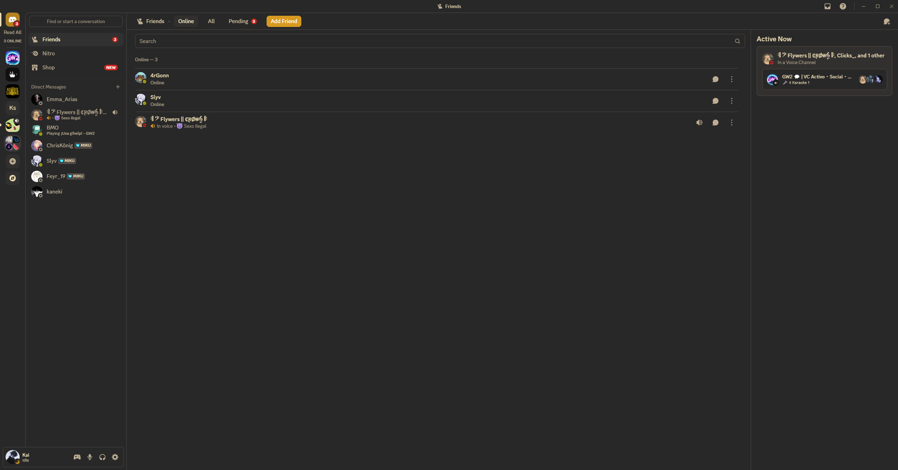
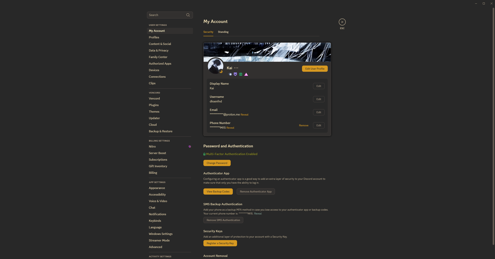
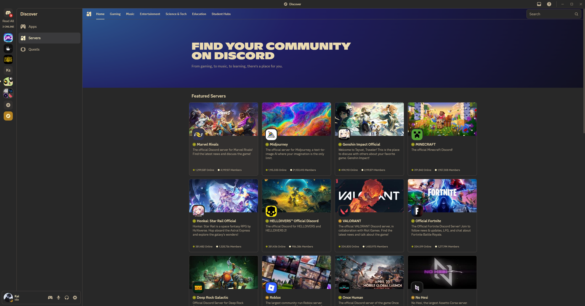

# Gruvbox Dark Discord Theme

A Gruvbox-inspired dark theme for Discord, designed for use with custom CSS loaders like [Vencord](https://vencord.dev/) or [GooseMod](https://goosemod.com/).

## Features
- Faithful Gruvbox color palette
- Consistent dark backgrounds (#282828)
- Custom accent colors for Discord UI
- Improved readability and aesthetics

## Installation
1. Download the `gruvbox-dark.theme.css` file from this repository.
2. Import it into your Discord client using a custom CSS loader (e.g., Vencord, GooseMod, or similar).
3. Enjoy the Gruvbox experience!

## Screenshot

| SS1 | SS2 | SS3 |
|---|---|---|
|  |  |  |

## Credits
- Theme by [0xStraker](https://github.com/0xStraker)
- Inspired by the original [Gruvbox](https://github.com/morhetz/gruvbox) color scheme

## License
See [LICENSE](LICENSE) for details. 